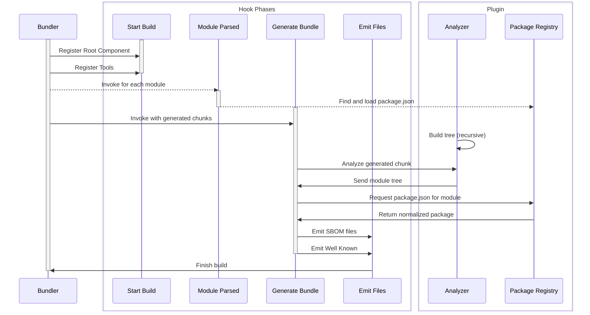

[](https://github.com/janbiasi/rollup-plugin-sbom/actions/workflows/ci.yml) [](https://github.com/janbiasi/rollup-plugin-sbom/actions/workflows/github-code-scanning/codeql) 
   [](https://securityscorecards.dev/viewer/?uri=github.com/janbiasi/rollup-plugin-sbom) [](https://www.bestpractices.dev/projects/8443) 

# rollup-plugin-sbom

Create [SBOMs]() _(Software Bill of Materials)_ in [CycloneDX](https://cyclonedx.org/) format for your [Vite](https://vitejs.dev/) and [Rollup](https://rollupjs.org/) projects, including only the software you're really shipping to production.

> A “software bill of materials” (SBOM) has emerged as a key building block in software security and software supply chain risk management. A SBOM is a nested inventory, a list of ingredients that make up software components.
>
> – [CISA (.gov)](https://www.cisa.gov) [[full article](https://www.cisa.gov/sbom)]

## Documentation

- [Requirements and compatibility](#requirements-and-compatibility)
- [Installation](#installation)
- [Usage guide](#usage)
  - [Usage with Vite](#usage-with-vite)
  - [Usage with Rollup](#usage-with-rollup)
  - [Configuration options and defaults](#configuration-options)
  - [Debugging](#debugging)
  - [Sequence chart](#sequence-chart)
- [Contributing](#contributing)
  - [Contribution workflow](#workflow)
  - [Make your first contribution](#good-first-issues)
  - [Contributors](#contributors)

---

### Requirements and Compatibility

| Plugin | Vite       | Rollup | Rolldown | Node       | CDX Spec |
| ------ | ---------- | ------ | -------- | ---------- | -------- |
| v1     | v4, v5     | v3, v4 | n.A.     | 18, 20     | 1.5      |
| v2     | v4, v5, v6 | v3, v4 | v1       | 18, 20, 22 | 1.6      |

We're always supporting LTS Node.js versions and versions which still have security support.
Plugin support will be dropped once a Node.js version reaches its final EOL.

### Installation

You can install the plugin via [NPM](https://www.npmjs.com/package/rollup-plugin-sbom) with your favorite package manager:

```sh
npm install --save-dev rollup-plugin-sbom
pnpm install -D rollup-plugin-sbom
yarn add --dev rollup-plugin-sbom
```

### Usage

#### Usage with [Vite](https://vitejs.dev/)

```ts
import { defineConfig } from "vite";
import sbom from "rollup-plugin-sbom";

export default defineConfig({
  plugins: [sbom()],
});

// or

export default defineConfig({
  build: {
    rollupOptions: {
      plugins: [rollupPluginSbom],
    },
  },
});
```

#### Usage with [Rollup](https://rollupjs.org/)

```js
import sbom from "rollup-plugin-sbom";

export default {
  plugins: [sbom()],
};
```

#### Configuration Options

| Name                | Default           | Description                                                |
| ------------------- | ----------------- | ---------------------------------------------------------- |
| `specVersion`       | `1.6`             | The CycloneDX specification version to use                 |
| `rootComponentType` | `application`     | The root component type, can be `library` or `application` |
| `outDir`            | `cyclonedx`       | The output directory where the BOM file will be saved.     |
| `outFilename`       | `bom`             | The base filename for the SBOM files.                      |
| `outFormats`        | `['json', 'xml']` | The formats to output. Can be any of `json` and `xml`.     |
| `saveTimestamp`     | `true`            | Whether to save the timestamp in the BOM metadata.         |
| `autodetect`        | `true`            | Whether to get the root package registered automatically.  |
| `generateSerial`    | `false`           | Whether to generate a serial number for the BOM.           |
| `includeWellKnown`  | `true`            | Whether to generate a SBOM in the `well-known` directory.  |
| `supplier`          | -                 | Provide organizational entity information                  |
| `beforeCollect`     | -                 | Enhance the BOM before before collecting dependencies      |
| `afterCollect`      | -                 | Transform the BOM before after collecting dependencies     |

### Debugging

This plugin added `debug` logs to gather information about how your SBOM is built so you can
understand why which dependency was added to the graph. To enable debugging, you can set the `logLevel` option to `"debug"`.

```ts
// rollup
export default {
  logLevel: "debug",
};

// vite
export default defineConfig({
  build: {
    rollupOptions: {
      logLevel: "debug",
    },
  },
});
```

<details>
<summary>Example output from our <a href="./test/fixtures/resolution/">test fixture "resolution"</a></summary>

General advice on when and how to read the debug information:

- Find out which tools are registered (`Registering tool <name>`)
- Find out which generated bundles are analyzed (`Processing generated module <filename>`)
- Check analyzed third party modules and their tree (`Processing <vendor-module> (imported by <filename> - depends on <transitive-deps>)`)

```text
[plugin rollup-plugin-sbom] Autodetection enabled, trying to resolve root component
[plugin rollup-plugin-sbom] Saving timestamp to SBOM
[plugin rollup-plugin-sbom] Generating serial number for SBOM
[plugin rollup-plugin-sbom] Registering tool rollup-plugin-sbom
[plugin rollup-plugin-sbom] Registering tool vite
[plugin rollup-plugin-sbom] Registering tool rollup
[plugin rollup-plugin-sbom] Processing generated module "index.js"
[plugin rollup-plugin-sbom] Found 4 external modules within "index.js"
[plugin rollup-plugin-sbom] Found 3 unique external modules accross all bundles
[plugin rollup-plugin-sbom] Processing a (imported by /rollup-plugin-sbom/test/fixtures/resolution/node_modules/a/index.js - depends on c)
[plugin rollup-plugin-sbom] Attaching nested dependency "c" to parent component a
[plugin rollup-plugin-sbom] Processing c (imported by /rollup-plugin-sbom/test/fixtures/resolution/node_modules/a/node_modules/c/index.js - depends on none)
[plugin rollup-plugin-sbom] Processing side-effect (imported by /rollup-plugin-sbom/test/fixtures/resolution/node_modules/b/node_modules/side-effect/index.js - depends on none)
[plugin rollup-plugin-sbom] Processing b (imported by /rollup-plugin-sbom/test/fixtures/resolution/node_modules/b/index.js - depends on a, side-effect)
[plugin rollup-plugin-sbom] Attaching nested dependency "a" to parent component b
[plugin rollup-plugin-sbom] Processing a (imported by /rollup-plugin-sbom/test/fixtures/resolution/node_modules/b/node_modules/a/index.js - depends on none)
[plugin rollup-plugin-sbom] Attaching nested dependency "side-effect" to parent component b
[plugin rollup-plugin-sbom] Emitting SBOM asset to plugin-outdir/filename.json
[plugin rollup-plugin-sbom] Emitting SBOM asset to plugin-outdir/filename.xml
[plugin rollup-plugin-sbom] Emitting well-known file to .well-known/sbom
```

</details>

### Sequence chart



## Contributing

The main purpose of this repository is to continue evolving the plugin, making it faster and easier to use. We are grateful to the community for contributing bugfixes and improvements. Read below to learn how you can take part in improving the plugin.

### Workflow

1. Fork the repository to your personal account
2. Ensure that all tests succeed (`pnpm build-fixtures` & `pnpm test`)
3. Propose changes within a PR to the original repository and write down the information required by the [pull request template](./.github/pull_request_template.md)
4. Wait for an approval for running the required [workflow checks](./.github/workflows/ci.yml) and a code-review from one of the maintainers

### Good First Issues

We have a list of [good first issues](https://github.com/janbiasi/rollup-plugin-sbom/labels/good%20first%20issue) that contain bugs that have a relatively limited scope. This is a great place to get started.

### Contributors

Thanks goes to these wonderful people ([emoji key](https://allcontributors.org/docs/en/emoji-key)):

<!-- ALL-CONTRIBUTORS-LIST:START - Do not remove or modify this section -->
<!-- prettier-ignore-start -->
<!-- markdownlint-disable -->
<table>
  <tbody>
    <tr>
      <td align="center" valign="top" width="14.28%"><a href="https://github.com/janbiasi"><br /><sub><b>Jan R. Biasi</b></sub></a><br /><a href="#business-janbiasi" title="Business development">💼</a> <a href="#question-janbiasi" title="Answering Questions">💬</a> <a href="#mentoring-janbiasi" title="Mentoring">🧑‍🏫</a> <a href="https://github.com/janbiasi/rollup-plugin-sbom/commits?author=janbiasi" title="Code">💻</a></td>
      <td align="center" valign="top" width="14.28%"><a href="https://github.com/boostvolt"><br /><sub><b>Jan Kott</b></sub></a><br /><a href="https://github.com/janbiasi/rollup-plugin-sbom/commits?author=boostvolt" title="Code">💻</a> <a href="#ideas-boostvolt" title="Ideas, Planning, & Feedback">🤔</a> <a href="#content-boostvolt" title="Content">🖋</a></td>
      <td align="center" valign="top" width="14.28%"><a href="https://github.com/xenobytezero"><br /><sub><b>xenobytezero</b></sub></a><br /><a href="https://github.com/janbiasi/rollup-plugin-sbom/issues?q=author%3Axenobytezero" title="Bug reports">🐛</a> <a href="https://github.com/janbiasi/rollup-plugin-sbom/commits?author=xenobytezero" title="Code">💻</a></td>
    </tr>
  </tbody>
</table>

<!-- markdownlint-restore -->
<!-- prettier-ignore-end -->

<!-- ALL-CONTRIBUTORS-LIST:END -->

### License

The plugin is licensed under [MIT License](./LICENSE)
