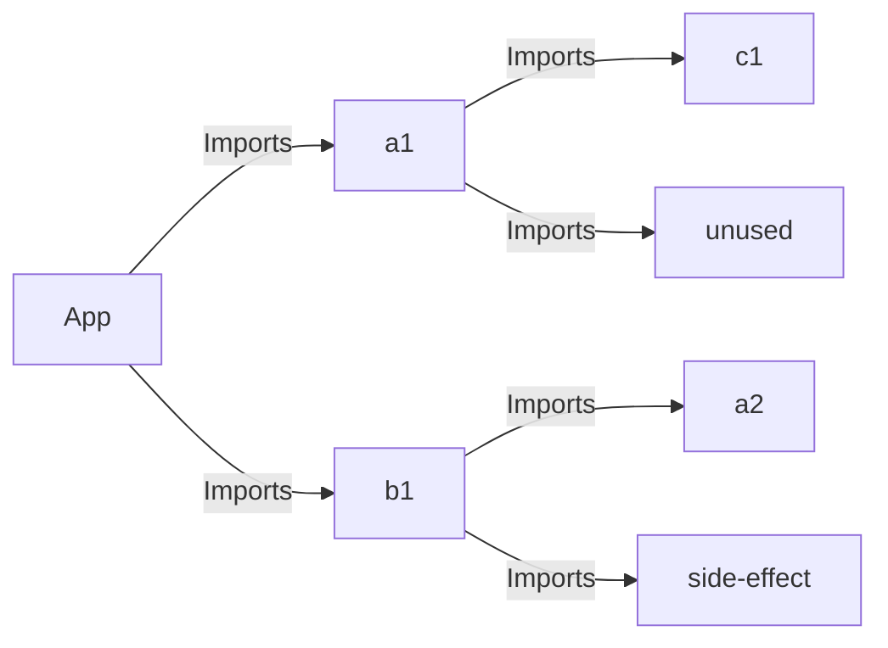

# Resolution Fixture

This test project verifies that modules and also nested modules are resolved correctly. It also considers the following common cases:
- A package is installed in multiple different versions with the same name
- A side-effect free package is imported but not used (tree-shaking)
- A package with side-effects is imported as a transitive dependency (impure)

### Development

The modules from `fake-tree` are automatically moved to the `node_modules` on postinstall. If you're developing and changing the modules, you can sync them with `pnpm postinstall`.

```sh
pnpm postinstall
pnpm build
```

### Module-/Import Tree

App depends on:
- A@v1
- B@v1

A@v1 depends on:
- C@v1
- unused@v1 (not used).

B@v1 depends on:
- A@v2
- side-effect@v1 (no exports, not tree-shakeable)



### Expected SBOM result

#### Components

```json
[
  {
    "type": "library",
    "name": "a",
    "version": "1.0.0",
    "bom-ref": "pkg:npm/a@1.0.0",
    "purl": "pkg:npm/a@1.0.0"
  },
  {
    "type": "library",
    "name": "c",
    "version": "1.0.0",
    "bom-ref": "pkg:npm/c@1.0.0",
    "purl": "pkg:npm/c@1.0.0"
  },
  {
    "type": "library",
    "name": "side-effect",
    "version": "1.0.0",
    "bom-ref": "pkg:npm/side-effect@1.0.0",
    "purl": "pkg:npm/side-effect@1.0.0"
  },
  {
    "type": "library",
    "name": "b",
    "version": "1.0.0",
    "bom-ref": "pkg:npm/b@1.0.0",
    "purl": "pkg:npm/b@1.0.0"
  },
  {
    "type": "library",
    "name": "a",
    "version": "2.0.0",
    "bom-ref": "pkg:npm/a@2.0.0",
    "purl": "pkg:npm/a@2.0.0"
  }
]
```

#### Dependencies

Acceptance Criteria for the generated SBOM
- `a` must be included in both version `1` and `2`
- `b` must include a reference to the package `a` in version `2` (transitive dependency)
- `unused` must not be part of the depencies at it was removed during tree-shaking (no [side-effects](https://rollupjs.org/configuration-options/#no-side-effects))
- `side-effect` must be included as the side-effect is not marked as [pure](https://rollupjs.org/configuration-options/#pure)

```json
 [
  {
    "ref": "pkg:npm/a@1.0.0",
    "dependsOn": [
      "pkg:npm/c@1.0.0"
    ]
  },
  {
    "ref": "pkg:npm/c@1.0.0"
  },
  {
    "ref": "pkg:npm/side-effect@1.0.0"
  },
  {
    "ref": "pkg:npm/b@1.0.0",
    "dependsOn": [
      "pkg:npm/a@2.0.0",
      "pkg:npm/side-effect@1.0.0"
    ]
  },
  {
    "ref": "pkg:npm/a@2.0.0"
  }
]
```
